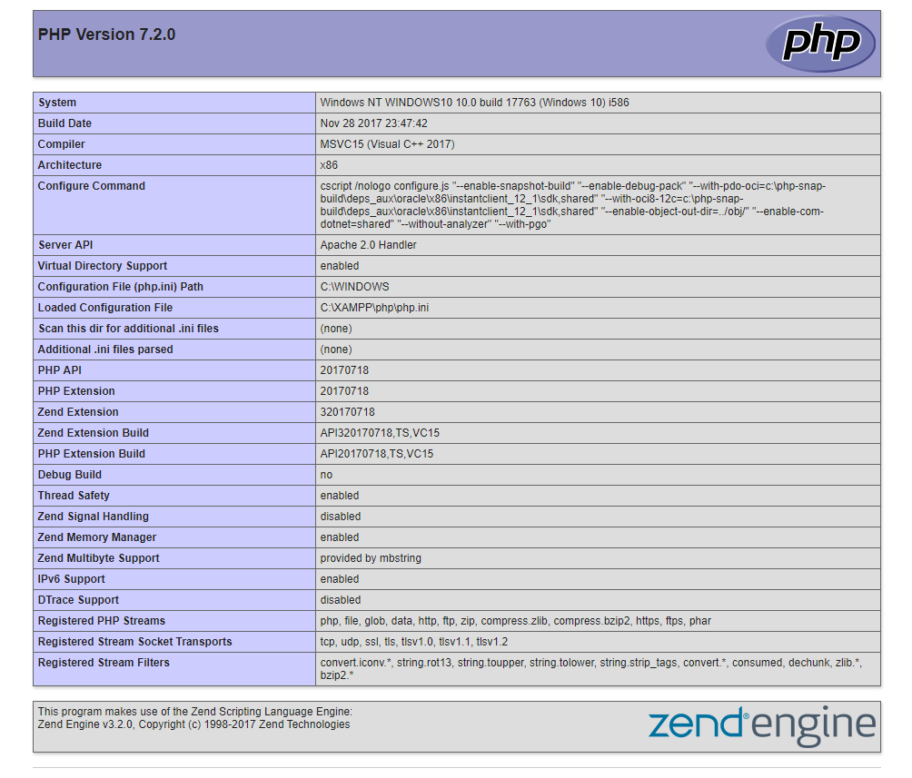
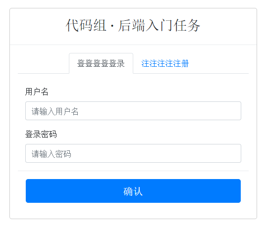
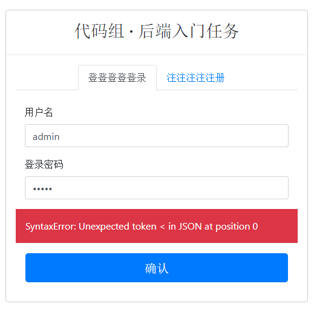
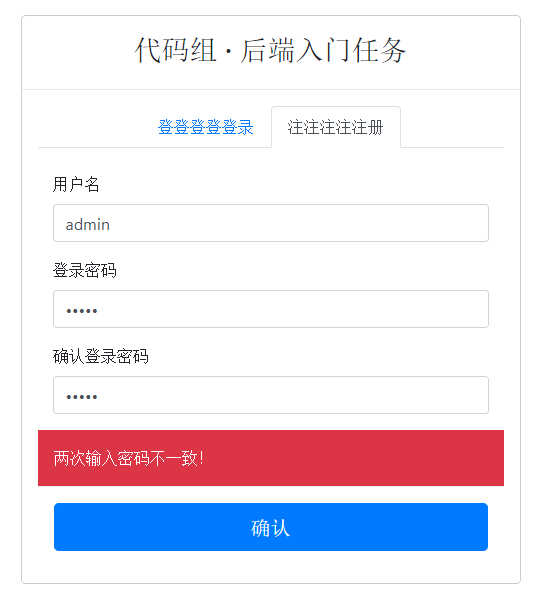
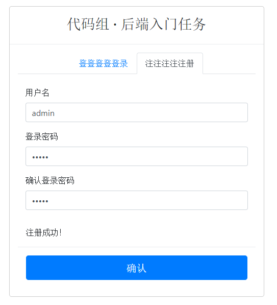
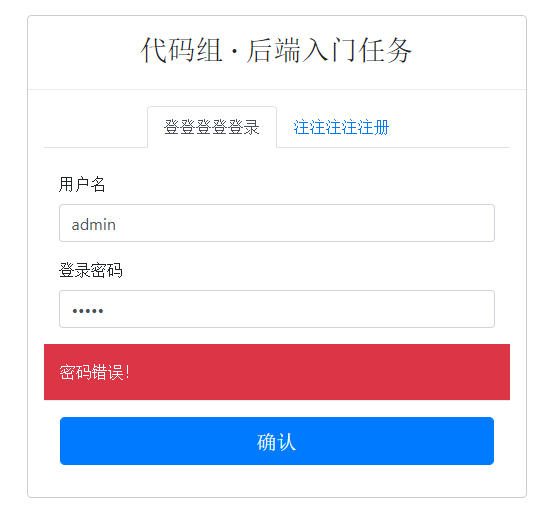
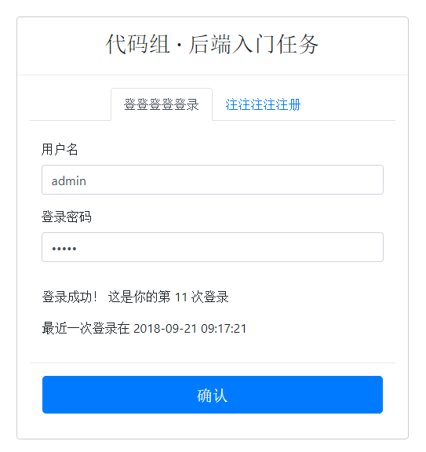

# 百步梯技术部 2018 级代码组后端入门任务
Kingsley, 2018.10.21

[TOC]

## 运行环境安装
XAMPP 中的一部分用于接受和处理 PHP 请求并把处理结果返回给请求方。

安装完成之后用以下代码写个 `info.php` 测试一下：

```php
<?php

phpinfo();
```

然后在浏览器中输入 `localhost/info.php`，如果出现了 PHP 的版本信息页面就说明环境是没问题的了，类似这样：



然后解压给你们发的文件，放进 `localhost` 对应的那个 `htdocs` 文件夹里面，去浏览器访问即可，比如访问 `localhost/task`：



## 需要完成的目标
- 了解 JSON 数据类型
  - 培训时具体介绍
- 用 phpMyAdmin 图形界面创建好数据库和数据表
  - 培训时具体介绍
- 学习 MySQL 增删查改的基础
  - 把 W3School 上的 [http://www.w3school.com.cn/sql/index.asp](http://www.w3school.com.cn/sql/index.asp) 前面一段 `SQL 基础教程` 部分按照顺序看完并理解。
  - 在 phpMyAdmin 上进行练习，熟练基本的 `SELECT`、`INSERT` 和 `UPDATE` 就可以。
- 学习 PHP 语言基础
  - 把 W3School 上的 [http://www.w3school.com.cn/php/index.asp](http://www.w3school.com.cn/php/index.asp) 按照顺序看，目前阶段看到 [PHP 数组](http://www.w3school.com.cn/php/php_arrays.asp) 就差不多了，后面的暂时不用管。
- 学习使用 PHP 连接 MySQL 所用的 mysqli
  - 培训时具体介绍，目前阶段只需要会用连接、增删查改等几个函数就 OK。
- 学习使用浏览器的开发者工具查看和分析发送、接收的信息
  - 培训时具体介绍

内容看起来可能稍微有点多，不用急着一口气全部理解，还是建议在实践中学习。

参考后端入门简介文章 [https://github.com/BBT-Tech/Blogs/blob/master/Backend/170926_Backend_Intro.md](https://github.com/BBT-Tech/Blogs/blob/master/Backend/170926_Backend_Intro.md)

另外，可能有同学比较偏向通过视频来学习，参考 [慕课网](http://www.imooc.com/) 等。还有就是尽早学会好好使用搜索引擎，**同级同学内部多交流**，实在不懂的也可以向师兄师姐提问，最好是在群里聊，这样可以避免很多人问重复的问题。不用担心自己的问题会不会太低级，积极学习是件好事，入门阶段遇到不懂的东西是正常现象。

## 任务要求
### 总览
##### 检查时间
2018.10.29 周一晚例会

##### 检查标准
在本地创建好数据库、数据表，使用给定的登录注册页面，完成登录和注册两个功能，对不同情况均需进行考虑，具体有哪些情景在下面的功能简介里面会详细说明。

登录的写在 `backend/login.php`，注册的写在 `backend/signup.php`，这两个文件是你们需要完成的，当然可以自己再添加一个数据库配置文件，但是**不要对 `backend` 文件夹以外的其它任何文件进行任何修改**。两个文件目前写的都是随机成功失败的返回值，所以可以多点几下看看操作的成功和失败分别会是什么效果，如果没问题的话就可以开始自己写了。

在后端中使用 `$_POST` 获取前端发送的信息，可用的字段如下：

- 用户名：`$_POST['username']`
- 密码：`$_POST['password']`
- 确认密码：`$_POST['checkpwd']`

返回给前端的需要是正确的 JSON 格式数据，如果点击按钮之后页面显示的错误信息是类似这样的：



即 `SyntaxError: Unexpected token x in JSON at position 0`，那说明返回的数据不是 JSON 类型，可能是格式错误也可能是运行出错，可以在浏览器控制台的 network 选项卡里面查看一下 response，学习一下如何检查和调试代码。

返回的 JSON 结构如下：

```json
{
    "errcode": 0,
    "errmsg": "",
    "data": {}
}
```

`errcode` 为 0 表示操作成功，为正整数表示操作失败，失败时需要在 `errmsg` 里面给出失败信息让前端可以用于提示用户，成功时在 `data` 里面给出对应的数据。

`Mockdata` 文件夹里面有示例数据格式，可以参考一下然后对比自己返回的数据格式是不是正确。

### 注册功能
##### 注册失败
返回错误信息给前端，`errcode` 为任意正整数，建议每种情况一个单独的值，不要重复，在 `errmsg` 里面给错误信息。

以下几种错误情况需要考虑并测试：

- 用户名已经存在
- 两次输入密码不一致
- 数据库连接出错

示例：



##### 注册成功
把用户名和密码信息**存入数据库**，并返回 `errcode` 为 0 即可。

示例：



### 登录功能
##### 登录失败
返回错误信息给前端，`errcode` 为任意正整数，建议每种情况一个单独的值，不要重复，在 `errmsg` 里面给错误信息。

以下几种错误情况需要考虑并测试：

- 用户名不存在
- 密码错误
- 数据库连接出错

示例：



##### 登录成功
返回 `errcode` 为 0，并在 `data` 里面给出以下信息：

```json
{
    "number_of_times": 11,
    "last_login_time": "2018-09-21 09:17:21"
}
```

`number_of_times` 表示第几次登录，`last_login_time` 表示最近一次登录的时间。

具体如何在数据库中存储，以什么方式保存这些登录信息，需要自己思考实现。注意登录成功之后需要把相关的数据写进数据库，因为下一次登录操作需要用到这些信息。

整个的返回数据格式示例参考 `Mockdata/login-succ.json`。

示例：


